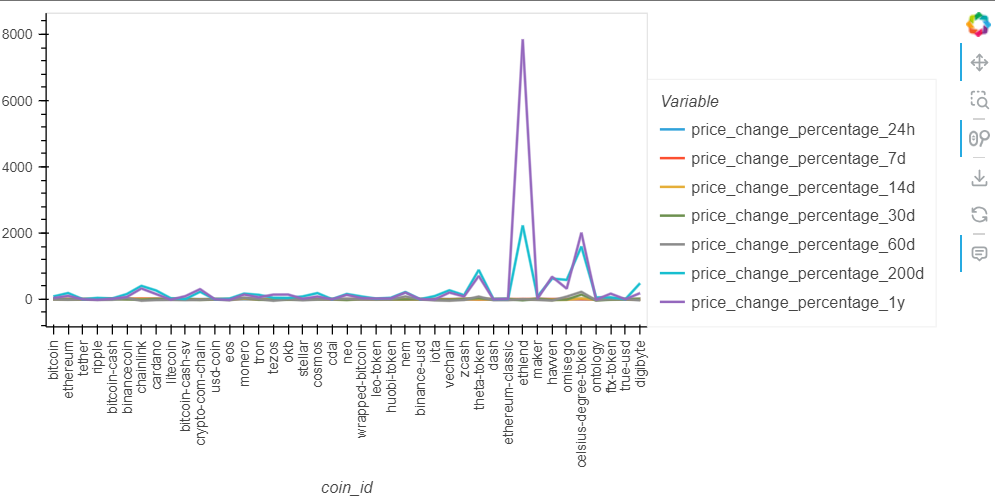
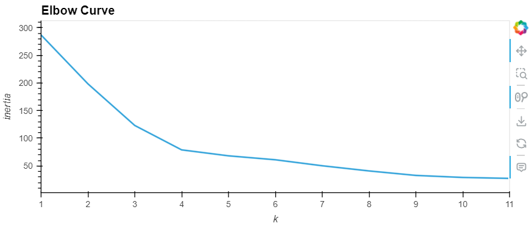
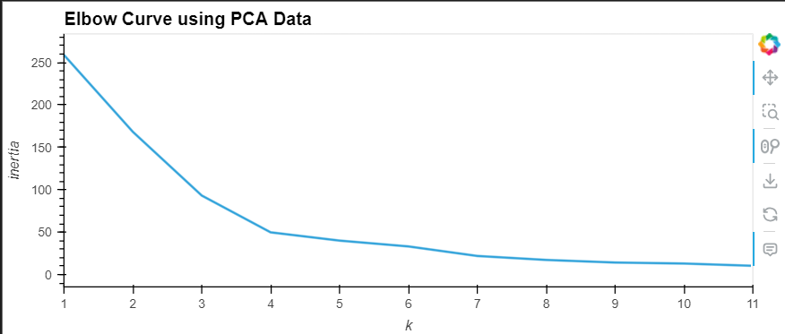
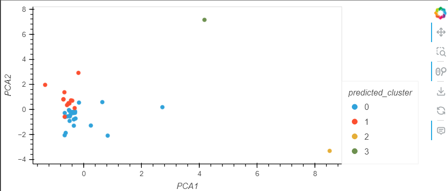
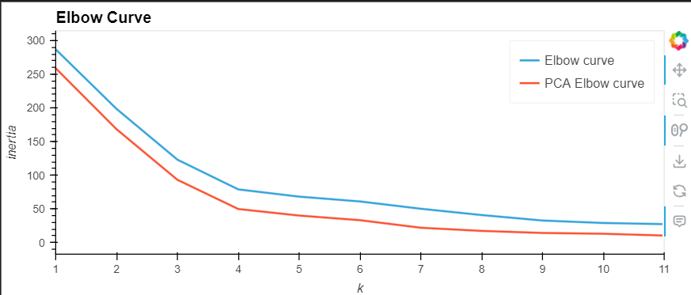
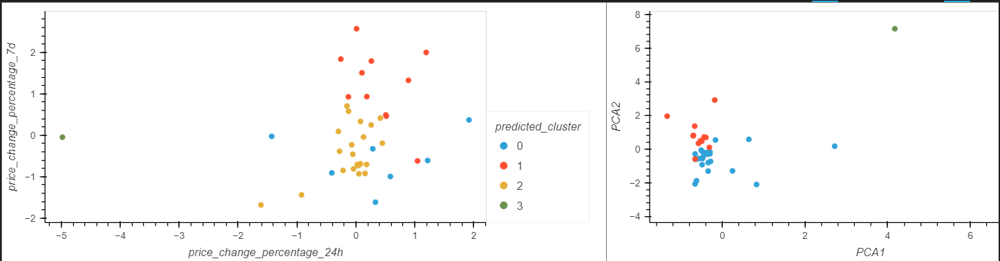

# CryptoClustering
## Steps to Follow:
### Prepare the Data:
Description:
Prepare the data by creating a DataFrame with scaled values. Set the "coin_id" index from the original DataFrame as the index for the new DataFrame.
### Find the Best Value for k Using the Original Scaled DataFrame:
Description:
Utilize the elbow method to determine the optimal value for k based on the original scaled data.
### Cluster Cryptocurrencies with K-means Using the Original Scaled Data:
Description:
Cluster the cryptocurrencies using the original scaled data with K-means algorithm, considering the optimal value of k obtained in the previous step.
### Optimize Clusters with Principal Component Analysis:
Description:
Perform Principal Component Analysis (PCA) on the original scaled DataFrame to reduce the features to three principal components, thus optimizing the clusters.
### Find the Best Value for k Using the PCA Data:
Description:
Determine the best value for k using the elbow method applied to the PCA-transformed data.
### Cluster Cryptocurrencies with K-means Using the PCA Data:
Description:
Cluster the cryptocurrencies using the PCA-transformed data, considering the optimal value of k obtained from the PCA analysis.

Screenshots:

